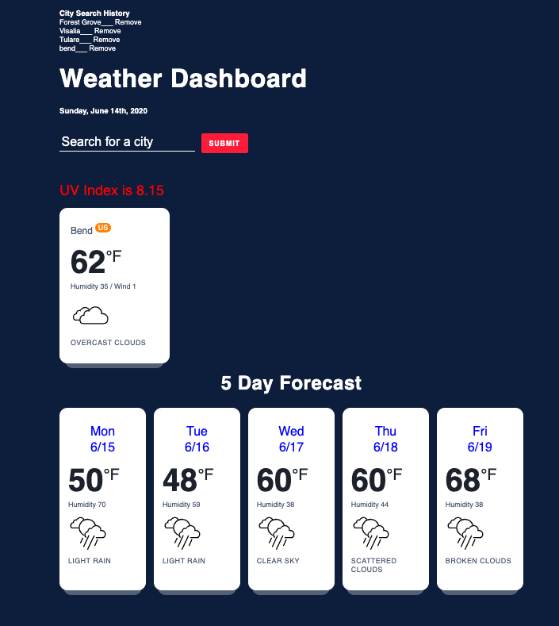

# 06 Server-Side APIs: Weather Dashboard

This assignment was to complete a functioning Weather Dashboard with several specific data points gathered through the OpenWeather API. This is a free weather API requiring a unique API Key which is available for any developer as long as they sign-up through the site. The dashboard needed to show unique weather for each city that was searched including temperature, humidity, wind speed, UV Index with color coding for standard levels, and icons that represented the weather for that city. We were required to craft API calls and retrieve data that gets stored inside the browser for current weather and a 5 day forecast. My weather dashboard features dynamically updated HTML and CSS powered by Javascript and jQuery. No starter code was provided for this assignment. I ended up using  HTML5, CSS3, the Moment.js library for date and time references, along with Javascript and jQuery code to complete this project.

## Project Details
Using the above mentioned technologies the deployed application was created. The application consists of the following elements:

 - Current day and date are presented at the top of the application.
 - A search history section which can be edited resides at the top for the user to see which cities have been searched recently.
 - The user is able to search for a city to find the weather and a five day forecast.
 - The temperature, humidity, wind speed, location, and weather icons appear for the city searched.
 - The date for each of the next five days appears on the five day forecast results below the current day information. 
 - The UV Index displays above the weather for the city that was searched.
 - The UV Index for the city displays in a different color based on the index results; green, yellow, orange, red, violet.
 
 
 ### Results
 The final weather dashboard product meets almost all of the requirements. I'm happy with the sleek look and feel of the site. The HTML is light with dynamically generated elements that show up and dissapear based on user interaction. The CSS is new and uses some variables for styling which I thought was pretty cool. However, I wasn't able to get the saved search results to appear on the page when the user returns. That will likely require a bit more work to resolve so that the pageload function grabs the last search and presents it on the page when the user comes back. I was able to get the search history to be persistent, so hopefully that is an even trade. Once again this was a very fun project and I'd like to go back through the dashboard and try to use dry code in both the HTML and Javascript files.

#### URL of Deployed Application + Image

 https://briansoldani.github.io/06-homework-assignment-06/

 